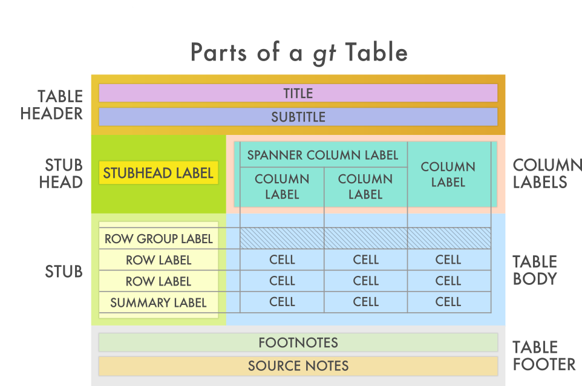
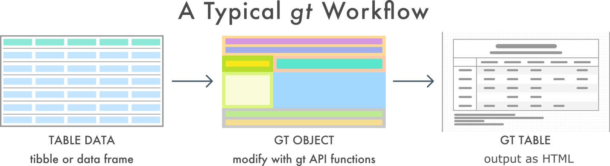

```{r setup, include=FALSE}
knitr::opts_chunk$set(echo = TRUE)
library(gt)
library(learnr)
tutorial_options(exercise.eval = TRUE)
```

## Introducción

Existen varios paquetes que permiten formatear las tablas de forma que consigamos una funcionalidad mayor y una mejor estética que la que se ofrece por defecto.

Entre estos paquetes se encuentar **kable+kableExtra** (<http://haozhu233.github.io/kableExtra/>), **formattable** (<https://renkun-ken.github.io/formattable/>), **DT** (<https://rstudio.github.io/DT/>, ).

Aquí vamos a ver el funcionamiento del paguete **gt** (<https://gt.rstudio.com/>) de RStudio, que nos permite trabajar con la misma idea de uso de gramática tal y como hacemos con **ggplot** y construir así las diferentes partes que componen una tabla.

### Partes de una tabla en gt

Veamos un gráfico que nos muestra cuales son las partes que define el paquete **gt** en una tabla.



### Partes de un flujo en gt

Veamos cual es el flujo de trabajo con las tablas.




Veamos como se visualizaría una dataframe como una tabla.

```{r}
data(mtcars)
mtcars
```

## Elementos básicos

### Creación de la tabla

Para crear la tabla usaremos la función `gt` .

```{r}
tabla_gt <- gt(head(mtcars))
tabla_gt
```

### Añadimos cabecera

Usaremos la función `tab_header` para poner **cabecera** a una tabla.

Prueba a modificar el **título** y **subtítlo** del ejemplo.

```{r cabecera, exercise=TRUE}
tabla_gt <- tabla_gt %>%
  tab_header(
    title = "Coches",
    subtitle = "Datos técnicos"
  )

tabla_gt
```

Podemos añadir mediante la función `md()` formato a la cabecera con **markdown**.

Prueba a modificar el formato poniendo el subtítulo todo en negretia.

```{r cabecera_formato, exercise=TRUE}
tabla_gt <- tabla_gt %>%
  tab_header(
    title = md("**Coches**"),
    subtitle = md("Datos *técnicos*")
  )

tabla_gt
```

### Añadimos pie

Usaremos la función `tab_footnote` para poner **pies de nota** en la propia tabla.

Prueba a cambiar el texto del pie de nota y asignarlo sólo a las dos primeras filas.

```{r pie, exercise=TRUE}
tabla_gt <- tabla_gt %>%
  tab_footnote(
    footnote = "pie de nota",
    locations = cells_body(
      columns = vars(mpg),
      rows = 3:4)
  )

tabla_gt
```

## Colores

Usaremos la función `data_color` para poner **color** a las celdas de una tabla. En este caso usaremos `scales::col_numeric` para asignar el color en función de un rango de números.

Prueba a poner colores a otra columna.

```{r colores, exercise=TRUE}
tabla_gt <- tabla_gt %>%
  data_color(
    columns = vars(hp),
    colors = scales::col_numeric(
      palette = c(
        "red", "white", "blue"),
      domain = c(90, 110))
  )

tabla_gt
```

## Datasets

El paquete de **gt** viene con 6 **datasets** para poder poner a prueba el uso de las posibilidades de **gt**. Los datasets incluidos son:

-   countrypops
-   sza
-   gtcars
-   sp500
-   pizzaplace
-   exibble

## Test

A continuación veamos si hemos aprendido el funcionamiento de las tablas con **gt**.

```{r pregunta1, echo=FALSE}
question("La función para crear las tablas con gt es:",
  answer("gt()", correct = TRUE),
  answer("create_table()"),
  answer("create_table_gt()"),
  allow_retry = TRUE,
  random_answer_order = TRUE
)
```

```{r pregunta2, echo=FALSE}
question("La función para suar colores en las celdas es:",
  answer("data_color()", correct = TRUE),
  answer("cell_color)"),
  answer("color_table()"),
  allow_retry = TRUE,
  random_answer_order = TRUE
)
```